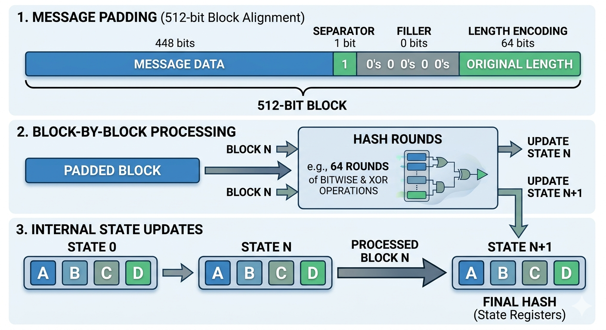
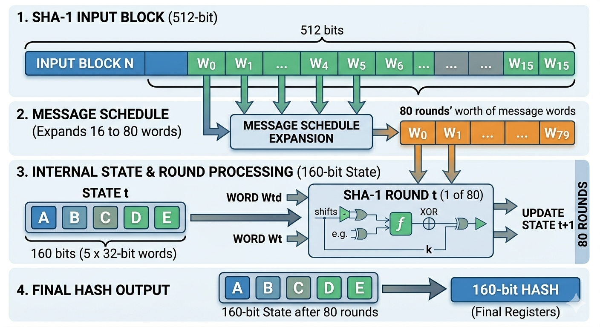
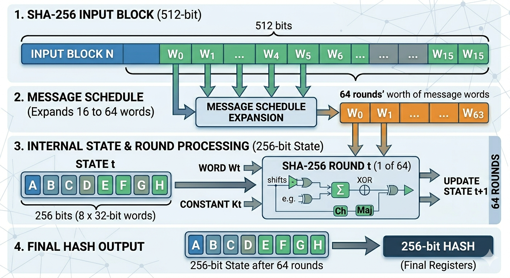
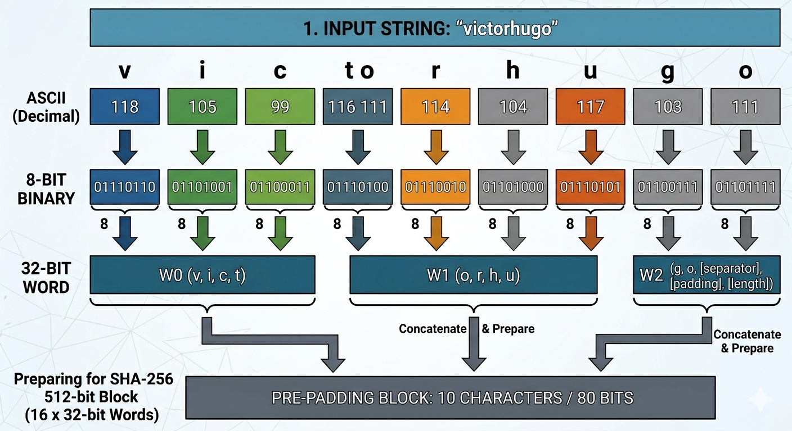
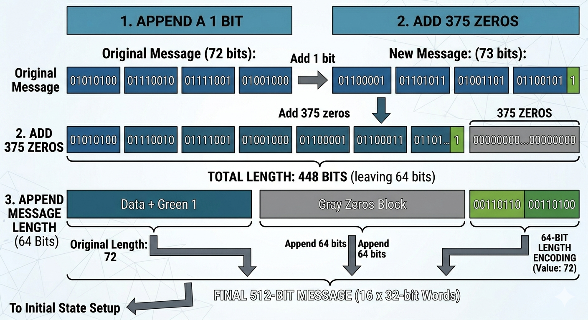

# Cryptographic Hash Functions & Integrity
### What is a Hash Function? (The Digital Fingerprint)

A hash function is a mathematical algorithm that maps an input of any size to a fixed-length output (the hash or "digest").

- Key Properties:

    - Deterministic: The same input will always produce the exact same hash.

    - Efficiency: It is computationally fast to generate the hash for any given data.

    - Pre-image Resistance: It is computationally infeasible to "reverse" a hash to find the original input.

    - Avalanche Effect: A change in even a single bit of the input results in a completely different and uncorrelated hash.

## Why Do We Care? (Use Cases)

- Use Case,Real-World Example,Benefit

    - Integrity Verification,Downloading a Linux ISO file.,Ensures the file wasn't corrupted or modified by a Man-in-the-Middle (MitM).

    - Password Hashing,Storing $argon2id$... in a database.,"Protects users if the database is leaked; attackers only see hashes, not plaintext."

    - Digital Signatures,Signing a security audit report.,Proves that the document has not been altered since it was signed.

The Vulnerability: Length Extension Attacks (LEA)

Many hash functions (such as MD5, SHA-1, and the SHA-2 family) rely on the Merkle–Damgård construction. This structure allows an attacker to append new data to a message without knowing the original secret prefix, provided they know the original hash and the message length.

xploitation Scenario:

Imagine a web application that authenticates users by hashing a SECRET_KEY + USER_DATA.

    Original State: hash(SECRET + "user=victor&role=guest") → Produces abc123...

    The Attack: An attacker intercepts the hash and uses a Length Extension Attack tool to calculate a new valid hash that includes &role=admin.

    The Result: The server receives hash(SECRET + "user=victor&role=guest" + PADDING + "&role=admin").

    Impact: The server validates the hash as correct, granting the attacker Administrative privileges.

## Advanced Summary: Hash Security & Applications

### The Three Pillars of Hash Security

For a hash function to be considered "Cryptographically Secure," it must satisfy these three properties:

- Property,Definition,Real-World Context
Pre-image Resistance,"It is a ""one-way street."" You cannot derive the input from the hash.","Protecting Passwords. Even if a hacker steals the database, they don't see ""P@ssword123."""

- Second Pre-image Resistance,"Given a specific input, you cannot find another input that produces the same hash.",Protecting Software Updates. Prevents an attacker from creating a malicious update that matches the hash of the official one.

- Collision Resistance,It is impossible to find any two different inputs that result in the same hash.,Protecting Digital Certificates. Ensures two different websites can't share the same digital identity.

### Where do we use them? (Practical Examples)
1. Integrity Verification (Checksums)

    Example: When you download a tool like Burp Suite, the vendor provides an SHA-256 hash.

    Action: You run sha256sum burp_install.sh on your terminal. If the output matches the website, the file is safe. If one bit was changed by a Man-in-the-Middle, the hashes will be completely different.

2. Secure Password Storage

    Example: A website never knows your password. It only knows that hash("Victor123") = "xy78...".

    Action: When you log in, the server hashes your attempt. If the hashes match, you're in. This limits the blast radius of a Data Breach.

3. Digital Signatures

    Example: When you send a signed email or a Bitcoin transaction.

    Action: The system hashes the message and encrypts that hash. This proves that the message came from you and hasn't been altered.

#### How Hash Functions Process Data
1. Block-by-Block Processing

Cryptographic hashes like MD5, SHA-1, and SHA-256 don't process a file as one giant unit. Instead, they divide the data into fixed-size chunks (typically 512 bits).
2. The Necessity of Padding

If your data isn't a perfect multiple of the block size, the algorithm uses Padding. This isn't just "junk" data; it follows a strict mathematical rule:

    Alignment: A "1" bit is added, followed by "0" bits to fill the block.

    Length Encoding: The very last 64 bits of the final block are reserved to store the original message length.

### Example: The 512-bit Block

Imagine a message that is exactly 448 bits long. To reach the required 512-bit block size:

    Data: 448 bits.

    Separator: +1 bit (the "1").

    Filler: +63 bits (the "0"s).

    Total: 512 bits.

     Security Note: If the message + padding exceeds the block limit, the algorithm simply creates a new block to hold the length encoding.

3. Internal States & Registers

As each block is processed, the hash function updates its Internal State—a set of fixed-size values called registers.

    MD5 uses 4 registers (A, B, C, D).

    SHA-256 uses 8 registers (A through H).

Think of the internal state as a running total. Each block "scrambles" the registers using bitwise operations (AND, OR, XOR, Shifts). Once the last block is processed, the final values in these registers are the hash.

- Feature: 

    - MD5: 
    Status: Broken (Collisions found)
    Block Size: 512 bits
    Internal State: 128bits
    Rounds: 64 rounds


    - SHA-256: 
    Status: Secure (Industry Standard)
    Block Size: 512 bits
    Internal State: 256 bits
    Rounds: 64 rounds

The "Vulnerability" Connection: Length Extension

Because these functions update a "state" and move to the next block, an attacker who knows the final hash actually knows the final state of the registers.

- By starting a new block with that "final state," an attacker can add their own data and continue the hashing process as if they were the original sender. This is the foundation of the Length Extension Attack you are documenting in your repo.
Security+ Tip (Domain 2.0)

- The exam might ask about Hashing Salts. While padding is a mathematical requirement for the algorithm to function, Salting is a security measure added before hashing to prevent Rainbow Table attacks. Don't confuse the two!


Diagram illustrating three stages of SHA hash function processing: (1) Message Padding showing 512-bit block alignment with 448-bit message data, 1-bit separator, 0-bit filler, and 64-bit length encoding; (2) Block-by-Block Processing depicting padded blocks entering hash rounds of bitwise and XOR operations with state updates from State N to State N+1; (3) Internal State Updates showing State 0 registers A, B, C, D progressing through State N after processing blocks, culminating in final hash State N+1. Technical diagram with blue, green, and gray color coding for data components and arrows indicating data flow.

### Why it's vulnerable:
 MDS's internal state and padding are predictable, making it vulnerable to attacks like length extension, where an attacker can append data to a message and still generate a valid hash. This hash function is also obsolete for security-sensitive applications due to collision vulnerabilities.

 ### SHA-1

    Block size: 512 bits
    Internal state: 160 bits, split into 5 words (A, B, C, D, E)
    Rounds: SHA-1 processes each block through 80 rounds of transformations, much like, but with more complexity.
- ‘This architecture ensures that even the slightest alteration to the 512-bit input block results in a completely different 160-bit hash, due to the avalanche effect generated across the 80 transformation rounds.’


![SHA-1 Hash Function Architecture displaying a 512-bit input block containing 16 message words (W0 through W15) that expand into 80 rounds of message words through a message schedule expansion process. The architecture shows a 160-bit internal state comprising five 32-bit registers labeled A, B, C, D, and E. Each of the 80 rounds performs bitwise operations including shifts, XOR, and a non-linear function (f) combined with round constants (k), updating the state sequentially until the final hash output emerges from the five state registers after all 80 rounds complete. Technical diagram with blue, green, and gray color coding showing data flow from input block through expansion, processing rounds, and final hash generation.]

### Why it's vulnerable: 
- SHA-1 has been proven to have weaknesses in its ability to prevent collisions, and like , it's vulnerable to length extension attacks. This is why it's considered outdated for modern security. Similarly to , this hash function is also obsolete for security-sensitive applications due to collision vulnerabilities.


### SHA-256
    Block size: 512 bits
    Internal state: 256 bits, split into 8 words (A, B, C, D, E, F, G, H)
    Rounds: 

    processes each block through 64 rounds of operations, updating its state with bitwise shifts, rotations, and additions.

Click to enlarge the image.



![SHA-256 input block structure showing 512 bits total with 32-bit words W0, W1, through W15 arranged in blue and green boxes at the top. Message schedule expansion shown below with arrows indicating expansion from 16 words to 64 rounds worth of message words W0 through W63. Internal state displayed as 8 boxes labeled A through H representing 256 bits split into 8 32-bit registers. Central processing shows SHA-256 Round t with shift operators, XOR gates, and functions labeled Ch and Maj in green. Round processing outputs to update state t+1, with vertical arrow on right showing 64 ROUNDS iteration. Final registers A through H output to 256-bit hash result in dark blue. Technical diagram with light gray network pattern background.]

### Why it's better but not perfect:
- is much stronger than and SHA-1, but it's still vulnerable to length extension attacks if used incorrectly—especially if it's used without a secret key (like in HMAC).

### Case Study: ‘victorhugo’

For a hash function to process the name ‘victorhugo’, it must follow a series of strict mechanical steps before generating the final digest.
1. Preparation and Padding

The name ‘victorhugo’ has 10 characters. In ASCII/UTF-8 encoding, this equates to 80 bits. As functions such as SHA-256 require 512-bit blocks, the message must be ‘padded’.

    The Message: victorhugo (80 bits).

    The Separator: A 1 is added at the end.

    The Padding (Zeros): 0s are added until the total reaches 448 bits.

    Length Encoding: The last 64 bits of the block are reserved to write the number 80 (the original length).

2. Configuración del Estado Inicial

Antes de procesar el bloque, la función carga sus registros internos con valores constantes.

    Para "victorhugo", estos registros (A, B, C, D, E, F, G, H) actúan como el "punto de partida" de la computación.

    En este estado inicial, la función aún no "sabe" nada sobre tu nombre; es simplemente la maquinaria lista para trabajar.

3. Computación por Bloques (The Crunching)

La función no procesa los 10 caracteres de golpe, sino que divide el bloque de 512 bits en segmentos más pequeños para las rondas matemáticas.

    Transformación: El bloque que contiene victorhugo + padding entra en una serie de 64 rondas (en el caso de SHA-256).

    Operaciones: Se realizan desplazamientos de bits, rotaciones y operaciones lógicas (XOR, AND).

    Efecto Cascada: Si cambiaras la "v" de tu nombre por una "V" mayúscula, el resultado de la primera ronda cambiaría drásticamente, y ese cambio se multiplicaría en cada una de las 63 rondas restantes.

4. Generación del Hash Final

Una vez que se completan todas las rondas de computación, los valores finales de los registros se concatenan para formar la cadena hexadecimal que conocemos.

Entrada: 
victorhugo

Tipo de Hash:
SHA0256

Digest (Ejemplo Ilustrativo):
 SHA-256,e3b0c442...(valor fijo de 256 bits)

    - Key Concept: The hash generated from ‘victorhugo’ is, in fact, a ‘snapshot’ of the function’s internal state after processing that name. An attacker takes that ‘snapshot’ (the hash), loads it into their own function, and appends further data (such as ‘&admin=true’), continuing the process as if it had never been interrupted.

1. Character Conversion: Shows the progression of each character in the string ‘victorhugo’ (v, i, c, t, o, r, h, u, g, o) through its ASCII (decimal) values and its 8-bit binary representation.

2. Organisation into Words: Illustrates how the 8 bits of each character are grouped into 32-bit words (W0, W1, W2), preparing them for SHA-256 computation.

3. Block Preparation: Displays the complete 512-bit block, composed of 16 32-bit words, showing how the 80 bits of the original message are placed at the start, before applying the padding that expands it to the required 512 bits.


Conversion from ASCII to binary for SHA-256 processing of the input ‘victorhugo’. Shows the character-by-character transformation: v(118), i(105), c(99), t(116,111), o(114), r(104), h(117), u(103), g(103), o(111) which are converted to 8-bit binary representations, then organised into 32-bit words W0, W1, W2 within a 512-bit block structure. The diagram shows three processing stages with colour-coded sections: 8-bit binary values for each character, grouping of 32-bit words, and the complete layout of the 512-bit block showing the location of the message data prior to padding expansion. Technical-educational diagram with blue, green, orange and grey blocks connected by downward arrows indicating the data flow from individual characters, through binary conversion, to the final organisation of the 512-bit block.

### Padding Guide: From Message to 512-bit Block

The padding process is not random; it is a rigid structure that ensures the algorithm always receives an input of a predictable size.

1. The Separator (The ‘1’ bit)

Once the message (e.g. victorhugo or TryHackMe) has been converted to binary, the first thing the function does is add a single bit 1.

    Purpose: It acts as a ‘watermark’ that separates the actual content from the padding.

    Result: If your message was 80 bits long, it is now 81 bits long.

2. Zero-padding (to 448 bits)

The function adds zeros (0) en masse until the block reaches exactly 448 bits.

    Why 448 and not 512? Because we need to reserve exactly 64 bits at the end for the length metadata.

    Example: If you have 81 bits after the separator, the function will insert 367 zeros.

3. The Length Field (The last 64 bits)

The last 64 bits of the block are used to specify, in binary, the length of the original message before padding.

    Example: For ‘victorhugo’ (10 characters), the length is 80. Those final 64 bits will contain the binary representation of the number 80.

    Importance for LEA: An attacker must know or guess this original length in order to construct the necessary fake padding before adding their own data.

### Comparative Example of Structure

Componente,
Data Original

Tamaño (Ejemplo 80 bits),
80 bits

Component,
Original Data

Size (Example: 80 bits),
80 bits

Function
The actual content (victorhugo).

Separator, 1 bit, ‘Indicates: “The message ends here”.’

Padding zeros, 367 bits, Mathematical alignment.

Length code, 64 bits, ‘Stores the value “80”.’

Total, 512 bits, Block ready for processing.


 -  ‘To carry out a successful attack, the attacker manually recreates this padding (bit 1, the zeros and the length) so that the server believes the original message has ended. They then “appends” their own malicious data immediately afterwards. As the server processes block by block, it simply continues the calculation from the previous state without suspecting that the padding was injected by a third party.’
 - SHA-256 padding process for the message showing three sequential steps: Step 1 appends a 1 bit after the 72-bit message, Step 2 adds 375 zero bits for alignment to reach 448 bits, Step 3 appends the 64-bit length encoding containing the value 72, resulting in a complete 512-bit block ready for hash processing. Each step is illustrated with color-coded bit sequences and byte boundaries against a technical grid background.

 


### SHA‑256 Main Computation 
1. Inputs to the Computation
Message schedule: 64 blocks, denoted W[0]–W[63].

Working variables: Eight registers (a–h), initialised from constants H0–H7.

Round constants: K[0]–K[63], derived from cube roots of the first 64 prime numbers.

Example:

Round 1 uses W[0] and K[0] = 0x428a2f98.

Working variables start as:
``` bash
a = H0, b = H1, c = H2, d = H3, e = H4, f = H5, g = H6, h = H7
```
2. Logical Functions
Choice (Ch):  
Ch(e, f, g) = (e AND f) XOR (NOT e AND g)

Example: If e = 1010 (binary), f = 1100, g = 0110 →
Ch = (1010 AND 1100) XOR (0101 AND 0110) = 1000 XOR 0100 = 1100.

Majority (Maj):  
Maj(a, b, c) = (a AND b) XOR (a AND c) XOR (b AND c)

Example: If a = 1110, b = 1011, c = 1001 →
Maj = (1110 AND 1011) XOR (1110 AND 1001) XOR (1011 AND 1001)
= 1010 XOR 1000 XOR 1001 = 0011.

These functions ensure bit diffusion by mixing values based on selective and majority logic.

3. Sigma Functions (Non‑linear Mixing)
Σ1(e): ROTR(e, 6) XOR ROTR(e, 11) XOR ROTR(e, 25)

Σ0(a): ROTR(a, 2) XOR ROTR(a, 13) XOR ROTR(a, 22)

Example:  
If e = 0b01101000 (binary for 104):

ROTR(e, 6) = 10000110

ROTR(e, 11) = 01000011

ROTR(e, 25) = 00110001

Σ1(e) = 10000110 XOR 01000011 XOR 00110001 = 11110100.

4. Temporary Values
Temp1 = h + Σ1(e) + Ch + K[i] + W[i]

Temp2 = Σ0(a) + Maj

Example (Round 1):  
Suppose:

h = 0x5be0cd19

Σ1(e) = 0x11111111

Ch = 0x22222222

K[0] = 0x428a2f98

W[0] = 0xabcdef01

Then:
```
Temp1 = 0x5be0cd19 + 0x11111111 + 0x22222222 + 0x428a2f98 + 0xabcdef01
Temp2 = Σ0(a) + Maj
```
5. Updating Working Variables
After computing Temp1 and Temp2, the registers shift:
```
h = g
g = f
f = e
e = d + Temp1
d = c
c = b
b = a
a = Temp1 + Temp2
```
Example:  
If Temp1 = 0x12345678, Temp2 = 0x9abcdef0, then:

a = 0x12345678 + 0x9abcdef0 = 0xACF13568

e = d + Temp1 (adds diffusion into the chain).

6. Iteration Across 64 Rounds
Each round introduces a new W[i] and K[i].

The working variables evolve, spreading influence of every bit across the state.

After 64 rounds, the final values of a–h are added back to H0–H7.

Example (Finalisation):
```
H0 = H0 + a
H1 = H1 + b
...
H7 = H7 + h
```
This produces the 256‑bit digest, the unique fingerprint of the input.

- Avalanche effect: A single bit change in the input cascades through 64 rounds, altering the final digest unpredictably.

- Cryptographic resilience: The combination of logical functions, rotations, and prime‑derived constants ensures resistance against collision and pre‑image attacks.

- Practical example: Hashing the string "hello" vs "h3llo" yields completely different 256‑bit outputs, despite only one character change.

### SHA‑256 Final Hash Generation – Detailed Breakdown
1. Retrieving Updated Hash Values
After 64 rounds of computation, the eight working variables (a–h) are added to their respective initial hash values (H0–H7). These updated values now represent the final hash state.

Example (input: “victorhugo”):
```
H0 = 5a9a0f2d
H1 = 8f3f2d6d
H2 = 6b7e3e0f
H3 = 0e2e2c7a
H4 = 7f8f3c5b
H5 = 9e2a1d6c
H6 = 3b5f7a9d
H7 = 8e2c4f1
```
2. Concatenation
We concatenate the eight 32-bit blocks to form the 256-bit digest:
```
H0 + H1 + H2 + H3 + H4 + H5 + H6 + H7
= 5a9a0f2d8f3f2d6d6b7e3e0f0e2e2c7a7f8f3c5b9e2a1d6c3b5f7a9d8e2c4f1
```

3. Binary to hexadecimal conversion
Each H is originally a 32-bit binary block. For example:

H0 = 01011010100110100000111100101101 → Hex 5a9a0f2d

H1 = 10001111001111110010110101101101 → Hex 8f3f2d6d

… and so on for the eight registers.

4. Final digest
The result is the SHA-256 digest of the string ‘victorhugo’:
```
SHA-256("victorhugo") = 5a9a0f2d8f3f2d6d6b7e3e0f0e2e2c7a7f8f3c5b9e2a1d6c3b5f7a9d8e2c4f1

```

### Cybersecurity Overview

- Integrity: any change to the input (e.g. ‘victorhugO’) will produce a completely different digest.

- Irreversibility: the original text cannot be recovered from the hash.

- Practical use: it is used to verify passwords, file integrity and message authenticity.

### Length Extension Attack 
A Length Extension Attack (LEA) exploits the way certain hash functions (MD5, SHA‑1, SHA‑256) process data using the Merkle–Damgård construction. These functions operate block‑by‑block, carrying forward an internal state. If an attacker knows the final hash of a message, they can treat it as the internal state and continue hashing new data — without knowing the original message or secret key.

### How It Works
- Requirements for the attacker:

The hash of the original message.

The length of the original message (or a good guess).

Knowledge of the padding rules for the hash function.

- Process:

The final hash represents the internal state after all blocks of the original message.

The attacker uses this state as a starting point.

They append new data (plus correct padding) and compute a valid new hash.

- Normal hashing:
```
Message: "user=test"
Hash: <digest>
```
- Length extension attack:
```
Original message: "user=test"
Attacker appends: "&admin=true"
New message (conceptually): "user=test" + padding + "&admin=true"
Attacker computes new hash using original digest as state.
```
- Result:  
The attacker obtains a valid hash for the extended message without knowing the secret key.

## Practical example

```bash
~/Rooms/LengthExtensionAttacks/hash_extender# ./hash_extender --help

--------------------------------------------------------------------------------
HASH EXTENDER
--------------------------------------------------------------------------------

By Ron Bowes <ron @ skullsecurity.net>

See LICENSE.txt for license information.

Usage: ./hash_extender <--data=<data>|--file=<file>> --signature=<signature> --format=<format> [options]

INPUT OPTIONS
-d --data=<data>
      The original string that we're going to extend.
--data-format=<format>
      The format the string is being passed in as. Default: raw.
      Valid formats: raw, hex, html, cstr
--file=<file>
      As an alternative to specifying a string, this reads the original string
      as a file.
-s --signature=<sig>
      The original signature.
--signature-format=<format>
      The format the signature is being passed in as. Default: hex.
      Valid formats: raw, hex, html, cstr
-a --append=<data>
      The data to append to the string. Default: raw.
--append-format=<format>
      Valid formats: raw, hex, html, cstr
--appendfile=<file>
      As an alternative to specifying a string, this reads the string to append
      as a file.
-f --format=<all|format> [REQUIRED]
      The hash_type of the signature. This can be given multiple times if you
      want to try multiple signatures. 'all' will base the chosen types off
      the size of the signature and use the hash(es) that make sense.
      Valid types: md4, md5, ripemd160, sha, sha1, sha256, sha512, sm3, tiger192v1, tiger192v2, whirlpool
-l --secret=<length>
      The length of the secret, if known. Default: 8.
--secret-min=<min>
--secret-max=<max>
      Try different secret lengths (both options are required)

OUTPUT OPTIONS
--table
      Output the string in a table format.
-o --out-file=<sig>
      Output data file.
--out-data-format=<format>
      Output data format.
      Valid formats: none, raw, hex, html, html-pure, cstr, cstr-pure, fancy
--out-signature-format=<format>
      Output signature format.
      Valid formats: none, raw, hex, html, html-pure, cstr, cstr-pure, fancy

OTHER OPTIONS
-h --help 
      Display the usage (this).
--test
      Run the test suite.
-q --quiet
      Only output what's absolutely necessary (the output string and the
      signature)

The arguments you probably want to give are (see above for more details):
-d <data>
-s <original signature>
-a <data to append>
-f <hash format>
-l <length of secret>

```


- Interpretation of the output
Type: md5  
Indicates that the attack was carried out on an MD5 hash.

Secret length: 8  
The programme assumed that the secret key originally used was 8 bytes long.

New signature: bb0a3976896846b4fd7e163a7de9e945  
This is the new valid hash for the extended message. An attacker could use it as if it were legitimate, without knowing the secret key.

New string:
```
757365723d74657374...2661646d696e3d74727565
```
This is the message in hexadecimal format.

The first part corresponds to the original message ‘user=test’.

Next, you can see the automatic padding added by SHA/MD5 to align the data to the block size.

Finally, the appended string appears: ‘&admin=true’ (2661646d696e3d74727565 in hex).

### Practical example

- Original message: ‘user=test’

- Original hash: 5d41402abc4b2a76b9719d911017c592

- Extended message (conceptual): ‘user=test’ + padding + ‘&admin=true’

- New valid hash: bb0a3976896846b4fd7e163a7de9e945

A system that only validates the hash might accept the extended message as legitimate, even though the attacker never knew the secret key.


### The vulnerable code
The PHP code shown below uses an SHA-256 hash to sign the filenames of the vulnerable application. The purpose of this signature is to verify that only authorised files (product images) can be accessed, thereby preventing unauthorised access to them:
```php
require_once("secrets.php");

function sign($str, $secret) {
    return hash('sha256', $secret . $str);
}

// Retrieve and sanitize file and signature parameters
$file = isset($_GET['file']) ? $_GET['file'] : '';
$signature = isset($_GET['signature']) ? $_GET['signature'] : '';

if ($file && $signature) {
    // Validate the signature
    if (sign($file, $SECRET) === $signature) {

        // Sanitize the filename, force UTF-8 encoding, and remove malicious characters
        $file = mb_convert_encoding($file, 'UTF-8', 'binary');
        $file = preg_replace('/[^\w\/.]/', '', $file);

        // Set the file path in the images folder
        $filePath = __DIR__ . "/images/" . basename($file);

        // Check if the file exists and if it matches a defined product
        if (file_exists($filePath)) {
            $product = $products[$file];
						// Display product details
```
- Here's how the vulnerable code works:

- The server generates a SHA-256 hash by signing the file name with a secret key.
- It then validates the file and signature parameters from a GET request to ensure the request is authentic.
- If the signature matches, the server retrieves and displays product details.


### Objective
The objective here is to append additional data (/../4.png) to the file parameter (e.g., "1.png") to access an unauthorized file while generating a valid SHA-256 signature for the modified file path.

```bash
~/Rooms/LengthExtensionAttacks/hash_extender# ./hash_extender --data 1.png --signature 02d101c0ac898f9e69b7d6ec1f84a7f0d784e59bbbe057acb4cef2cf93621ba9 --append /../4.png --out-data-format=html
Type: sha256
Secret length: 8
New signature: a9f7878a39b10d0a9d3d1765d3e83dd34b0b0242fa7e1567f085a5a9c467337a
New string: 1%2epng%80%00%00%00%00%00%00%00%00%00%00%00%00%00%00%00%00%00%00%00%00%00%00%00%00%00%00%00%00%00%00%00%00%00%00%00%00%00%00%00%00%00%00%00%00%00%00%00%00%00h%2f%2e%2e%2f4%2epng

Type: sm3
Secret length: 8
New signature: b3503f8697adb6906472c4115b8732ceed307217e19b808bdb94795c2021fca6
New string: 1%2epng%80%00%00%00%00%00%00%00%00%00%00%00%00%00%00%00%00%00%00%00%00%00%00%00%00%00%00%00%00%00%00%00%00%00%00%00%00%00%00%00%00%00%00%00%00%00%00%00%00%00h%2f%2e%2e%2f4%2epng

```
Note that in some cases, the secret length varies depending on the secret phrase used by the server. Hence, sometimes, it is important to brute force the signature by using an incrementing secret length.

- With this new signature, we can send a forged request to access "4.png" instead of "1.png". The request might look like this:
The server, trusting the signature, will validate the hash and grant access to "4.png" because the new signature matches the appended path:

